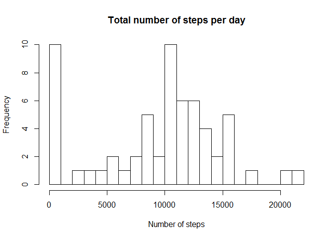
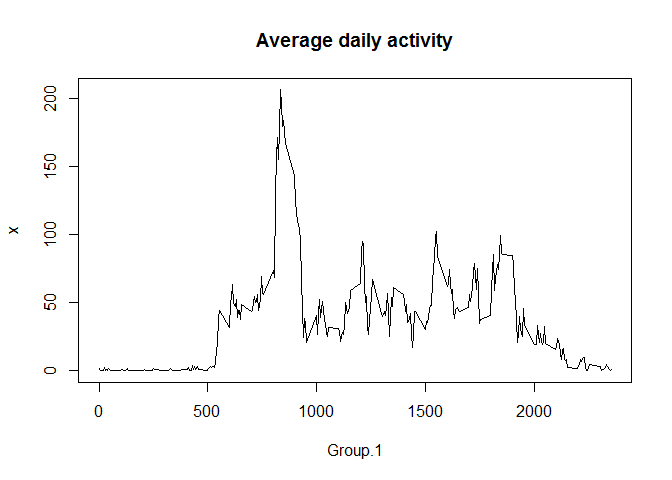
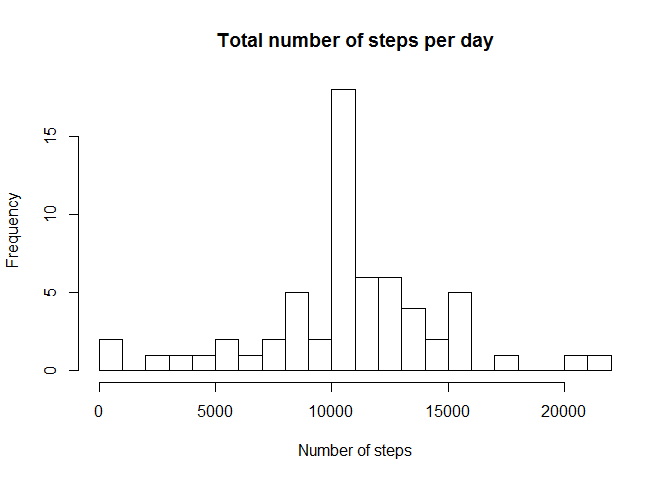
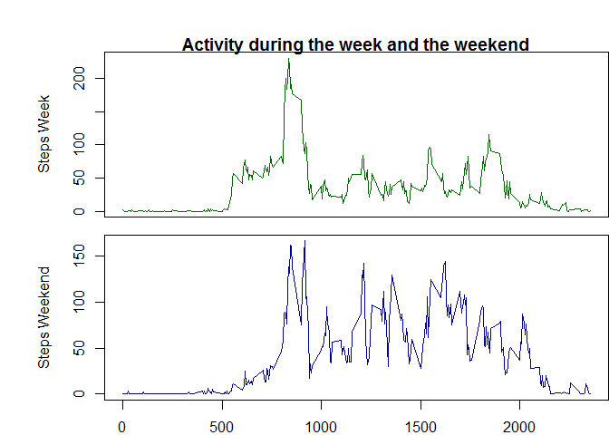

# Reproducible Research: Peer Assessment 1


## Loading and preprocessing the data


## What is mean total number of steps taken per day?
###Total

```r
totalPerDay<-aggregate(activity$steps, by=list(activity$date), FUN=sum, na.rm=TRUE)
hist(totalPerDay$x, breaks = 20, main = "Total number of steps per day", xlab = "Number of steps")
```

<!-- -->

###Mean and Median


```r
meanT<-mean(totalPerDay$x, na.rm = TRUE)
medianT<-median(totalPerDay$x, na.rm=TRUE)
```
The mean of the total steps per day is 9354.2295082 and the median is 10395.

## What is the average daily activity pattern?

```r
meanIntervalPerDay<-aggregate(activity$steps, by=list(activity$interval), FUN=mean, na.rm=TRUE)
plot(x=meanIntervalPerDay, main="Average daily activity", type="l")
```

<!-- -->


## Imputing missing values

```r
NAs<-sum(is.na(activity$steps))
```
The total number of missing values we need to take care of is 2304.
###Imputing missing values


```r
resultData<-activity
for (i in 1:nrow(resultData)){
  if(is.na(resultData$steps[i])){
    resultData$steps[i]<-mean(resultData$steps[resultData$interval==resultData$interval[i]], na.rm = TRUE)
  }
}
rm("i")
```

###New statistics calculated after taking care of the missing values


```r
totalPerDayNew<-aggregate(resultData$steps, by=list(activity$date), FUN=sum)
hist(totalPerDayNew$x, breaks = 20, main = "Total number of steps per day", xlab = "Number of steps")
```

<!-- -->

```r
meanTNew<-mean(totalPerDayNew$x, na.rm = TRUE)
medianTNew<-median(totalPerDayNew$x, na.rm=TRUE)
```
The new mean and median are respectively 1.0766189\times 10^{4} and 1.0766189\times 10^{4}.


## Are there differences in activity patterns between weekdays and weekends?


```r
days<-weekdays(as.Date(resultData$date))
resultData$weekdays<-"day"
for (i in 1:nrow(resultData)){
  if(days[i]=="Saturday"|days[i]=="Sunday")
    resultData$weekdays[i]<-"weekend"
  else
    resultData$weekdays[i]<-"weekday"
}
rm("i")
```


```r
meanWeekday<-aggregate(resultData$steps[which(resultData$weekdays=="weekday")], by=list(resultData$interval[which(resultData$weekdays=="weekday")]), FUN=mean)
meanWeekend<-aggregate(resultData$steps[which(resultData$weekdays=="weekend")], by=list(resultData$interval[which(resultData$weekdays=="weekend")]), FUN=mean)
par(mfrow=c(2,1))
par(mar=c(0,4,1,0))
par(oma=c(2,2,2,0))
plot(meanWeekday, ylab="Steps Week", xlab="", type="l", xaxt="n", main="Activity during the week and the weekend", lwd=1.5, col="darkgreen")
plot(meanWeekend, ylab="Steps Weekend", xlab="", type="l", lwd=1.5, col="darkblue")
```

<!-- -->
