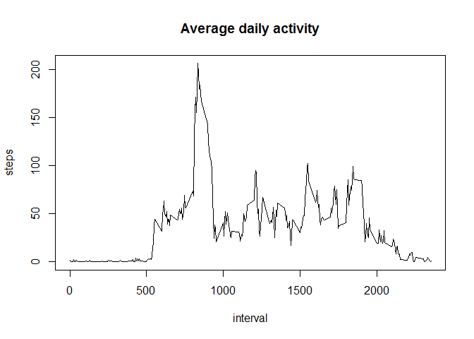

# Reproducible Research: Peer Assessment 1


## Loading and preprocessing the data

```r
activity<-read.csv("activity.csv")
options(scipen = 999)
```


## What is mean total number of steps taken per day?
###Total

```r
totalPerDay<-aggregate(activity$steps, by=list(activity$date), FUN=sum, na.rm=TRUE)
hist(totalPerDay$x, breaks = 20, main = "Total number of steps per day", xlab = "Number of steps")
```

<!-- -->

###Mean and Median


```r
meanT<-mean(totalPerDay$x, na.rm = TRUE)
medianT<-median(totalPerDay$x, na.rm=TRUE)
```
The mean of the total steps per day is 9354.2295082 and the median is 10395.

## What is the average daily activity pattern?

```r
meanIntervals<-aggregate(activity$steps, by=list(activity$interval), FUN=mean, na.rm=TRUE)
names(meanIntervals)<-c("interval", "steps")
plot(x=meanIntervals, main="Average daily activity", type="l")
```

<!-- -->

## What is the interval with maximum steps?

```r
maxSteps<-meanIntervals[which.max(meanIntervals$steps),]
```
The interval with maximum steps is 835, with average steps being 206.1698113

## Imputing missing values

```r
NAs<-sum(is.na(activity$steps))
```
The total number of missing values we need to take care of is 2304.

###Imputing missing values - strategy
An easy way to get some meaningful values instead of missing ones is to get the average across all the days for that specific interval. This seems to be a better strategy than getting average for a day, as there are some days for which there are no measurements. 

```r
resultData<-activity
library(plyr)
```

```
## Warning: package 'plyr' was built under R version 3.3.2
```

```r
#create a data frame with just the missing values we need
missing<-resultData[is.na(resultData$steps),]
#merge the missing values data frame with the means per interval
missing<-merge(missing, meanIntervals, by = "interval")
#delete unnecessary repeating column with missing values
missing<-missing[,-2]
names(missing)[3]<-"steps"
#remove the rows with missing values and put in the rows from the completed data frame
resultData<-na.omit(resultData)
resultData<-rbind(resultData, missing)
rm("missing")

#arrange the date since it was mixed up by the bind
resultData<-arrange(resultData, resultData$date, resultData$interval)
```

###New statistics calculated after taking care of the missing values


```r
totalPerDayNew<-aggregate(resultData$steps, by=list(activity$date), FUN=sum)
hist(totalPerDayNew$x, breaks = 20, main = "Total number of steps per day", xlab = "Number of steps")
```

<!-- -->

```r
meanTNew<-mean(totalPerDayNew$x, na.rm = TRUE)
medianTNew<-median(totalPerDayNew$x, na.rm=TRUE)
```
The new mean and median are respectively 10766.1886792 and 10766.1886792.


## Are there differences in activity patterns between weekdays and weekends?


```r
resultData$days<-weekdays(as.Date(resultData$date))
resultData$weekdays<-"weekday"
resultData$weekdays[which(resultData$days=="Saturday"|resultData$days=="Sunday")]<-"weekend"
```


```r
meanWeekday<-aggregate(resultData$steps[which(resultData$weekdays=="weekday")], by=list(resultData$interval[which(resultData$weekdays=="weekday")]), FUN=mean)
meanWeekend<-aggregate(resultData$steps[which(resultData$weekdays=="weekend")], by=list(resultData$interval[which(resultData$weekdays=="weekend")]), FUN=mean)
par(mfrow=c(2,1))
par(mar=c(0,4,1,0))
par(oma=c(2,2,2,0))
plot(meanWeekday, ylab="Steps Week", xlab="", type="l", xaxt="n", main="Activity during the week and the weekend", lwd=1.5, col="darkgreen")
plot(meanWeekend, ylab="Steps Weekend", xlab="", type="l", lwd=1.5, col="darkblue")
```

<!-- -->
